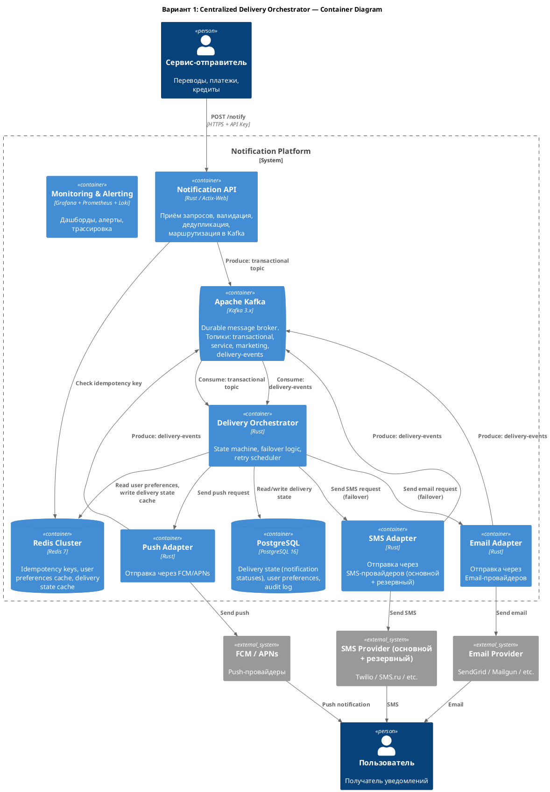
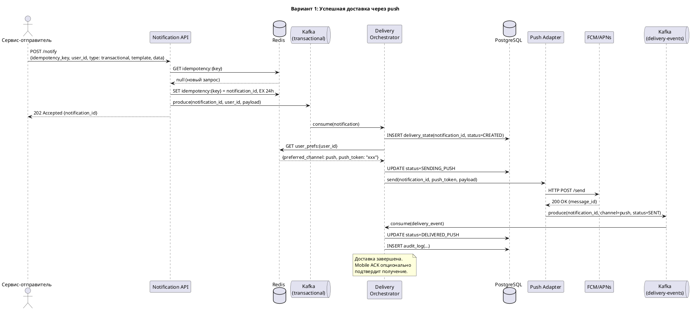
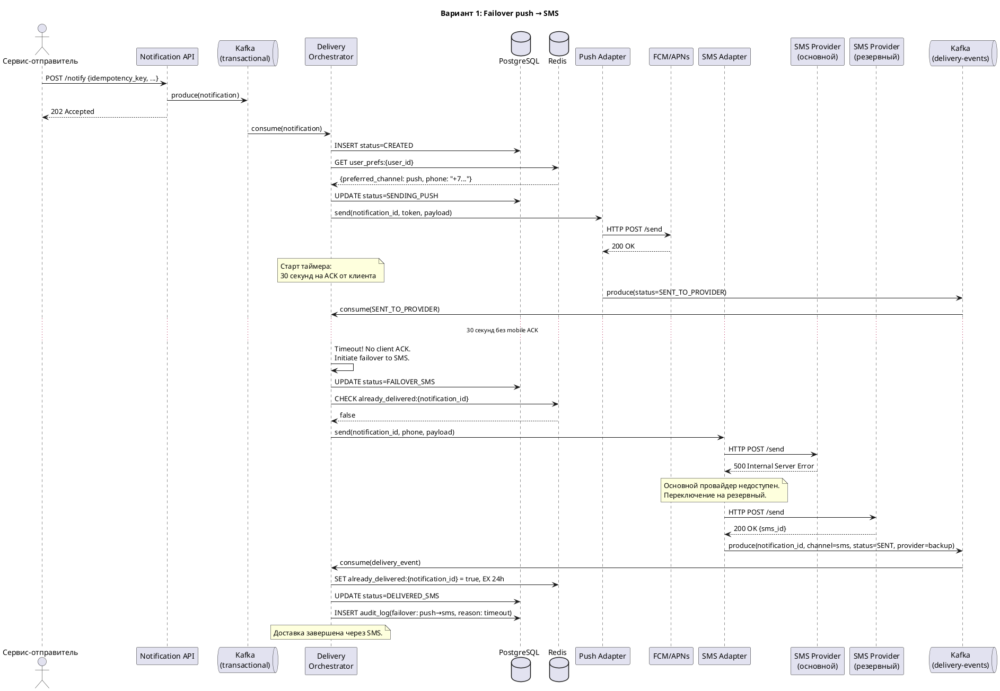
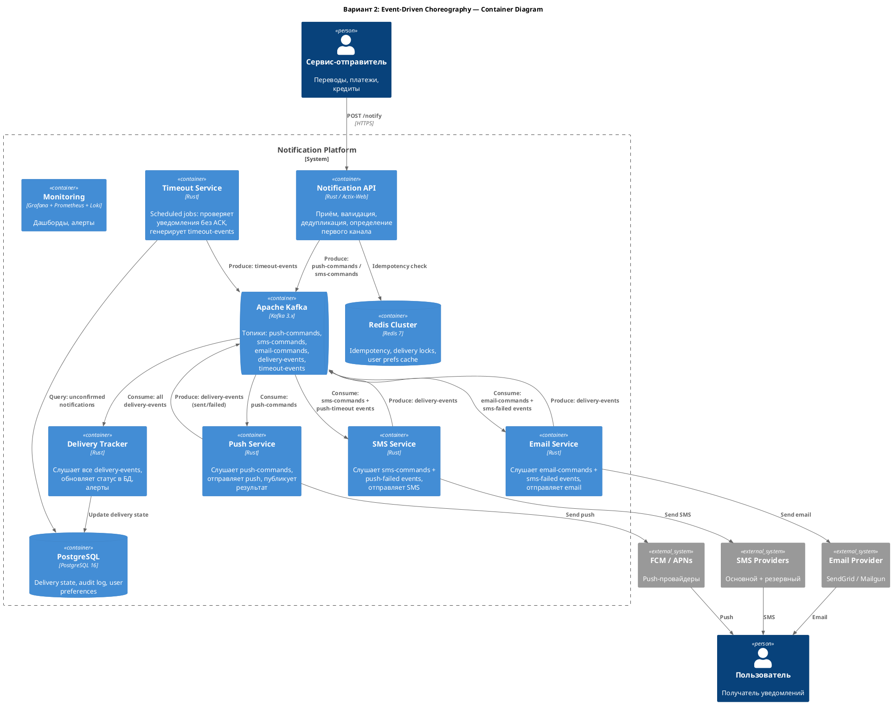
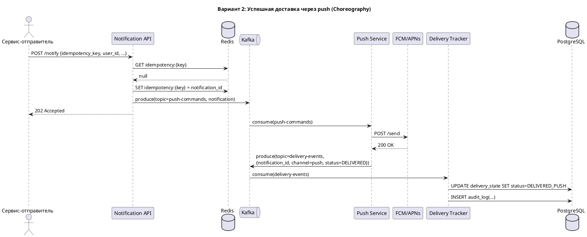
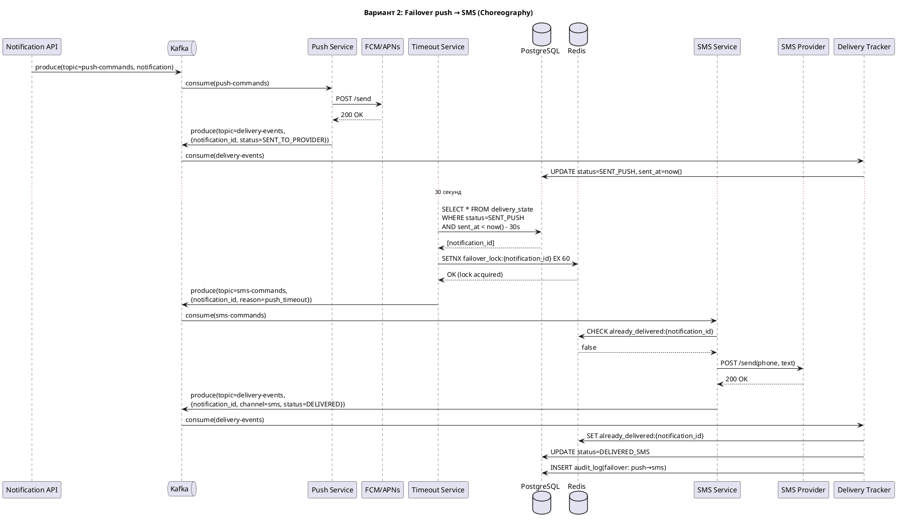

# Домашнее задание №4 — Централизованная платформа уведомлений (Notification Platform)

---

## 1. Функциональные требования

### FR-1: Отправка транзакционных уведомлений в реальном времени
**User Story:** Как пользователь, я хочу мгновенно получать уведомление при каждом списании или зачислении средств, чтобы контролировать свои финансы и вовремя обнаружить мошеннические операции.

**Связь с бизнес-целями:** Гарантированная доставка критичных уведомлений; снижение жалоб на 30%.

### FR-2: Управление подписками на уведомления
**User Story:** Как пользователь, я хочу управлять категориями уведомлений и каналами доставки (push/SMS/email), чтобы получать только актуальную информацию удобным для меня способом.

**Правила отключения:**
- **Транзакционные уведомления** — нельзя отключить (критичны для безопасности). Пользователь может только переключить предпочтительный канал.
- **Сервисные уведомления** — можно отключить выборочно (например, напоминания), но уведомления о статусах заявок на кредиты/карты нельзя отключить до завершения процесса.
- **Маркетинговые уведомления** — можно полностью отключить.

**Связь с бизнес-целями:** Увеличение retention на 15% за счёт уважения к предпочтениям пользователя; снижение жалоб.

### FR-3: Массовая рассылка маркетинговых кампаний
**User Story:** Как маркетолог, я хочу отправлять персонализированные акции и предложения сегментам до 1 млн пользователей, чтобы повысить вовлечённость и конверсию.

**Связь с бизнес-целями:** Увеличение retention на 15%.

### FR-4: Кросс-канальный failover с гарантией доставки
**User Story:** Как пользователь, я хочу гарантированно получить критичное уведомление хотя бы через один канал, даже если мой основной канал недоступен, чтобы не пропустить важную информацию.

**Связь с бизнес-целями:** Гарантированная доставка критичных уведомлений.

### FR-5: Единый API для всех команд-отправителей
**User Story:** Как разработчик в команде переводов/платежей/кредитов, я хочу отправлять уведомления через единый API с указанием типа, шаблона и данных, чтобы не реализовывать логику доставки самостоятельно.

**Связь с бизнес-целями:** Централизованный контроль; устранение дублирования; снижение жалоб.

### FR-6: Дедупликация уведомлений
**User Story:** Как пользователь, я не хочу получать одно и то же уведомление дважды, даже если отправляющий сервис вызвал API повторно из-за таймаута.

**Связь с бизнес-целями:** Снижение жалоб на 30%.

### FR-7: Отслеживание статуса доставки
**User Story:** Как оператор поддержки, я хочу видеть полную историю уведомлений пользователя (что, когда, через какой канал, доставлено ли), чтобы быстро решать обращения.

**Связь с бизнес-целями:** Снижение жалоб; наблюдаемость.

---

## 2. Нефункциональные требования

### NFR-1: Низкая задержка транзакционных уведомлений
- **Метрика:** Время от получения запроса платформой до отправки в канал доставки ≤ **1 секунда** для 99-го перцентиля (p99).
- **Обоснование:** Пользователь ожидает уведомление о списании практически мгновенно. Задержка > 3 секунд воспринимается как сбой.

### NFR-2: Высокая пропускная способность
- **Метрика:** Система должна обрабатывать не менее **50 000 уведомлений в секунду** в пиковые моменты (массовая рассылка + нормальный поток транзакций).
- **Расчёт:** DAU 3 млн × 10 уведомлений = 30 млн/день ≈ 350 RPS средних. Пиковый множитель ×5 = 1 750 RPS для органического потока. Массовая кампания на 1 млн за 30 минут ≈ 555 RPS. Итого пик ~2 500 RPS в нормальном режиме. Запас ×20 для burst = 50 000 RPS.

### NFR-3: Доступность (Availability)
- **Метрика:** SLA ≥ **99.95%** (не более ~22 минут простоя в месяц).
- **Обоснование:** Недоступность платформы означает потерю всех уведомлений банка; транзакционные — критичны для безопасности.

### NFR-4: Гарантия доставки критичных уведомлений
- **Метрика:** Доля успешно доставленных транзакционных уведомлений (хотя бы через один канал) ≥ **99.9%**.
- **Обоснование:** Прямое требование бизнеса; влияет на безопасность и доверие.

### NFR-5: Горизонтальная масштабируемость
- **Метрика:** Система должна линейно масштабироваться при росте MAU до 50 млн без изменения архитектуры.
- **Обоснование:** Банк растёт; перепроектирование при росте — дорого.

### NFR-6: Устойчивость к отказам внешних провайдеров
- **Метрика:** При полном отказе одного SMS/email-провайдера переключение на резервного ≤ **10 секунд**; потеря уведомлений — 0.
- **Обоснование:** Внешние провайдеры нестабильны (заявлено в контексте).

### NFR-7: Наблюдаемость (Observability)
- **Метрика:** Время обнаружения аномалии (рост ошибок, падение rate доставки) ≤ **1 минута**. Сквозная трассировка каждого уведомления.
- **Обоснование:** Без наблюдаемости невозможно гарантировать SLA.

---

## 3. Архитектурно значимые требования (ASR)

### ASR-1: Низкая задержка доставки транзакционных уведомлений (p99 ≤ 1 с)

**Связанные требования:** FR-1, NFR-1, NFR-2

**Почему влияет на архитектуру:**
- Требует выделения приоритетного потока обработки транзакционных уведомлений, отдельного от маркетинговых/сервисных.
- Запрещает синхронные вызовы с длительным ожиданием в критическом пути.
- Влияет на выбор брокера сообщений (нужна low-latency очередь), модель хранения (in-memory или быстрый кэш для дедупликации) и топологию развёртывания.
- Определяет необходимость приоритизации в очередях.

**Приоритет:** Критический

### ASR-2: Гарантированная доставка с кросс-канальным failover

**Связанные требования:** FR-4, FR-6, NFR-4, NFR-6

**Почему влияет на архитектуру:**
- Требует хранения состояния доставки каждого уведомления (state machine) для отслеживания статуса по каждому каналу.
- Вводит механизм retry и escalation (push → SMS → email) с таймаутами.
- Необходима идемпотентность на каждом шаге для предотвращения дублирования.
- Требует надёжного хранилища (durable queue / WAL), чтобы сообщение не терялось при падении компонента.
- Определяет модель взаимодействия: оркестрация (централизованный координатор) vs хореография (saga).

**Приоритет:** Критический

### ASR-3: Высокая пропускная способность при массовых рассылках (до 50 000 RPS)

**Связанные требования:** FR-3, NFR-2, NFR-5

**Почему влияет на архитектуру:**
- Требует горизонтально масштабируемой архитектуры с партиционированием нагрузки.
- Массовые рассылки не должны влиять на задержку транзакционных уведомлений → необходима изоляция потоков (разные очереди/топики, rate-limiting для маркетинга).
- Влияет на выбор хранилища (шардирование), брокера (партиции Kafka), и паттерн деплоя (отдельные consumer-группы).

**Приоритет:** Высокий

### ASR-4: Наблюдаемость и аудит доставки

**Связанные требования:** FR-7, NFR-7

**Почему влияет на архитектуру:**
- Требует сквозного tracing ID через все компоненты.
- Необходимо централизованное хранилище логов/событий (event sourcing или append-only log).
- Влияет на формат данных, межсервисные контракты и инфраструктуру мониторинга.

**Приоритет:** Высокий

---

## 4. Ключевые архитектурные вопросы

### AQ-1: Оркестрация vs хореография для failover-цепочки?

**Порождается:** ASR-2 (гарантированная доставка с failover)

**Суть вопроса:** Должен ли failover между каналами (push → SMS → email) управляться централизованным оркестратором (Delivery Orchestrator) или каждый канал-адаптер сам решает, передавать ли запрос следующему?

**Почему важен:**
- Оркестратор даёт единую точку контроля и наблюдаемости, но может стать bottleneck и single point of failure.
- Хореография (saga) лучше масштабируется, но усложняет отладку и мониторинг, делает логику доставки размазанной по сервисам.
- Решение определяет топологию сервисов, зависимости и паттерны отказоустойчивости.

### AQ-2: Как изолировать транзакционный поток от маркетингового?

**Порождается:** ASR-1 (низкая задержка), ASR-3 (высокая пропускная способность)

**Суть вопроса:** Как обеспечить, чтобы массовая рассылка на 1 млн пользователей не влияла на задержку транзакционных уведомлений?

**Почему важен:**
- Варианты: разные топики/очереди с разными consumer-группами; физически отдельные инстансы; приоритетные очереди.
- Определяет архитектуру брокера, стратегию деплоя, распределение ресурсов и cost model.

### AQ-3: Как обеспечить идемпотентность и дедупликацию при failover?

**Порождается:** ASR-2 (гарантированная доставка), FR-6 (дедупликация)

**Суть вопроса:** Как гарантировать, что при retry/failover пользователь не получит одно и то же уведомление дважды через один или разные каналы?

**Почему важен:**
- Требует уникального idempotency key на каждое уведомление и хранения состояния доставки.
- Влияет на выбор хранилища состояний (нужна быстрая запись/чтение), модель данных и взаимодействие с провайдерами.
- Дублирование SMS — это прямые финансовые потери банка.

### AQ-4: Какую стратегию multi-provider использовать для SMS/email?

**Порождается:** NFR-6 (устойчивость к отказам провайдеров), ASR-2

**Суть вопроса:** Использовать active-passive (один провайдер + горячий резерв) или active-active (балансировка между провайдерами)?

**Почему важен:**
- Active-active даёт лучшую утилизацию и быстрый failover, но усложняет логику дедупликации и мониторинг.
- Active-passive проще, но переключение может занять время.
- Влияет на контракты с провайдерами, стоимость и архитектуру адаптеров.

---

## 5. Архитектурные последствия ASR

### ASR-1: Низкая задержка транзакционных уведомлений (p99 ≤ 1 с)

**Последствия:**
- Выделенная высокоприоритетная очередь/топик для транзакционных уведомлений, отдельная от остальных типов.
- Минимизация hop-ов в критическом пути: API → брокер → канал-адаптер → провайдер (3 hop-а максимум).
- In-memory кэш для дедупликации и пользовательских настроек (Redis), чтобы избежать синхронных запросов в БД.
- Предварительная загрузка (warm cache) пользовательских предпочтений по каналам.
- Consumer-группы транзакционной очереди с выделенными ресурсами (dedicated pods/instances).

### ASR-2: Гарантированная доставка с кросс-канальным failover

**Последствия:**
- State machine для каждого уведомления: `CREATED → SENDING → DELIVERED | FAILED → FAILOVER → SENDING(next_channel) → ...`
- Персистентное хранилище состояний (PostgreSQL) с WAL для crash recovery.
- Durable message queue (Kafka с acks=all) для гарантии at-least-once delivery.
- Idempotency key в каждом запросе к провайдеру и проверка перед отправкой.
- Таймауты на подтверждение доставки по каждому каналу (push: 30 с, SMS: 60 с, email: 120 с).
- Dead Letter Queue (DLQ) для уведомлений, которые не удалось доставить ни через один канал → алерт и ручная обработка.

### ASR-3: Высокая пропускная способность при массовых рассылках

**Последствия:**
- Отдельные топики Kafka для каждого типа уведомлений (transactional, service, marketing).
- Rate limiter для маркетинговых рассылок, чтобы не переполнять внешних провайдеров.
- Горизонтальное масштабирование consumer-ов (Kafka consumer groups с partitioning по user_id).
- Batch-отправка для маркетинговых уведомлений (группировка запросов к провайдерам).
- Backpressure механизм: при перегрузке маркетинговые замедляются, транзакционные — никогда.

### ASR-4: Наблюдаемость и аудит

**Последствия:**
- Сквозной `trace_id` и `notification_id` во всех логах, метриках и событиях.
- Event sourcing: каждое изменение статуса уведомления — событие в append-only log.
- Dashboards в реальном времени: delivery rate, latency percentiles, error rate по типам и каналам.
- Alerting при отклонении от SLA (delivery rate < 99.9%, latency p99 > 1 с).
- Structured logging (JSON) с обязательными полями: notification_id, user_id, type, channel, status, timestamp.

---

## 6. Архитектурные решения, которые НЕ подходят

### Неподходящее решение 1: Синхронная REST-to-REST доставка

**Описание:** Сервис-отправитель вызывает REST API платформы, которая синхронно вызывает провайдера и возвращает результат.

**Какой ASR нарушается:** ASR-1 (низкая задержка), ASR-3 (высокая пропускная способность), ASR-2 (гарантированная доставка)

**Почему не подходит:**
- Синхронный вызов к внешнему провайдеру (SMS/email) может занимать секунды → нарушает p99 ≤ 1 с.
- При недоступности провайдера запрос блокируется или возвращает ошибку → нет failover.
- Нет буферизации → при пиковой нагрузке или массовой рассылке сервис не справится (50 000 RPS × время ожидания ответа = огромный thread pool).
- Потеря сообщений при перезагрузке сервиса (нет персистентной очереди).

### Неподходящее решение 2: Единая очередь для всех типов уведомлений без приоритизации

**Описание:** Все уведомления (транзакционные, сервисные, маркетинговые) попадают в одну общую очередь и обрабатываются в порядке FIFO.

**Какой ASR нарушается:** ASR-1 (низкая задержка транзакционных), ASR-3 (изоляция потоков)

**Почему не подходит:**
- Массовая рассылка на 1 млн пользователей забьёт очередь → транзакционные уведомления встанут в хвост → задержка минуты вместо секунд.
- Head-of-line blocking: медленные маркетинговые сообщения блокируют быстрые транзакционные.
- Невозможно независимо масштабировать обработку разных типов.

### Неподходящее решение 3: Polling-based delivery confirmation

**Описание:** Платформа периодически опрашивает провайдеров о статусе доставки (вместо webhook/callback).

**Какой ASR нарушается:** ASR-2 (failover с таймаутами), ASR-1 (задержка)

**Почему не подходит:**
- Polling interval создаёт дополнительную задержку обнаружения неуспешной доставки → failover запускается позже → нарушение SLA.
- При 30 млн уведомлений в день polling создаёт огромную нагрузку на провайдеров и на саму систему.
- Неэффективное использование ресурсов (большинство poll-ов не вернут новых данных).

---

## 7. Неопределённости и архитектурные риски

### Неопределённость 1: Реальные SLA и callback-возможности внешних провайдеров

**Что неизвестно:**
- Гарантируют ли провайдеры SMS/email callback (webhook) о статусе доставки? С какой задержкой?
- Какой реальный uptime каждого провайдера? Какая частота и длительность сбоев?
- Поддерживают ли провайдеры idempotency key на своей стороне?

**Как проверить:**
- Запросить SLA-документацию у текущих и потенциальных провайдеров.
- Провести нагрузочное тестирование с каждым провайдером (latency, error rate, callback delay).
- Собрать статистику инцидентов за последние 6 месяцев.
- Реализовать shadow mode: параллельно отправлять через двух провайдеров и сравнивать delivery rate.

**Влияние на архитектуру:**
- Если callback-и ненадёжны, понадобится гибридный подход (webhook + poll с большим интервалом как fallback).
- Если uptime провайдеров < 99.5%, нужно минимум 2 провайдера на каждый канал в active-active режиме.

### Неопределённость 2: Точное определение «доставлено» для push-уведомлений

**Что неизвестно:**
- Считать ли push «доставленным» при accept от FCM/APNs, или при фактическом отображении на устройстве?
- FCM/APNs могут принять сообщение, но устройство offline → уведомление придёт позже (или не придёт, если TTL истёк).
- Какой процент push-уведомлений реально не доходит до пользователя?

**Как проверить:**
- Внедрить client-side confirmation: мобильное приложение отправляет ACK при отображении push.
- Собрать метрики: FCM accept rate vs client ACK rate → определить реальный delivery gap.
- На основе данных установить корректные таймауты для failover (если нет client ACK за N секунд → escalation на SMS).

**Влияние на архитектуру:**
- Если push ненадёжен, failover-таймаут должен быть коротким → больше SMS → выше стоимость.
- Необходим SDK в мобильном приложении для АСК → координация с командой мобильной разработки.

### Неопределённость 3: Требования регулятора к хранению уведомлений

**Что неизвестно:**
- Как долго нужно хранить историю уведомлений (финансовый регулятор может требовать 5+ лет)?
- Есть ли требования к формату хранения и возможности аудита?
- Нужно ли хранить содержимое уведомления или достаточно метаданных?

**Как проверить:**
- Проконсультироваться с юридическим отделом и compliance.
- Изучить требования ЦБ РФ к хранению информации о транзакциях и уведомлениях.

**Влияние на архитектуру:**
- Длительное хранение → cold storage (S3/архивная БД), partitioning по дате.
- Полнотекстовое хранение → значительно больший объём данных → другой класс хранилища.

---

## 8. RFC: Гарантированная доставка критичных уведомлений с кросс-канальным failover

---

# RFC-001: Проектирование механизма гарантированной доставки критичных (транзакционных) уведомлений с автоматическим failover между каналами доставки

| Метаданные | Значение |
|------------|----------|
| **Статус** | DRAFT |
| **Автор(ы)** | Notification Platform Team |
| **Ответственный** | Notification Platform Team Lead |
| **Бизнес-заказчик** | Директор по цифровым каналам |
| **Ревьюеры** | Backend Architecture Team (2026-04-10), Security Team (2026-04-10), Mobile Team (2026-04-12) |
| **Дата создания** | 2026-04-07 |
| **Дата обновления** | 2026-04-07 |

---

## Оглавление

1. [Контекст](#контекст)
2. [Продуктовый анализ](#продуктовый-анализ)
3. [Пользовательские сценарии](#пользовательские-сценарии)
4. [Статистика](#статистика)
5. [Требования](#требования)
6. [Варианты решения](#варианты-решения)
7. [Сравнительный анализ](#сравнительный-анализ)
8. [Выводы](#выводы)
9. [Связанные задачи](#связанные-задачи)

---

## Контекст

> **Цель раздела:** Описать проблему или возможность, которую решает данное предложение.

Текущая архитектура банка не имеет централизованного механизма доставки уведомлений. Каждая команда (переводы, платежи, кредиты, маркетинг) реализует отправку самостоятельно:
- Нет гарантии доставки критичных (транзакционных) уведомлений.
- Нет автоматического переключения на альтернативный канал при отказе основного.
- Дублирование уведомлений при retry.
- Нет единой наблюдаемости процесса доставки.

**Бизнес-импакт:** Недоставленное уведомление о списании средств приводит к обращениям в поддержку, потере доверия и потенциальным финансовым рискам для пользователя.

### Ключевые вопросы
- **Какую проблему мы решаем?** Отсутствие гарантированной доставки транзакционных уведомлений с автоматическим failover между каналами (push, SMS, email).
- **Почему это важно сейчас?** Количество жалоб на уведомления растёт; бизнес ставит цель снизить их на 30% и обеспечить 99.9% delivery rate для критичных сообщений.
- **Кто затронут этим изменением?** Все пользователи банка (10 млн MAU), команды-отправители уведомлений, операторы поддержки, SRE-команда.

---

## Продуктовый анализ

Транзакционные уведомления (подтверждение перевода, списание средств и т.п.) являются критичными — их недоставка напрямую влияет на пользовательский опыт и безопасность. При этом каждый канал доставки имеет свои характеристики:

| Канал | Надёжность | Задержка | Стоимость | Особенности |
|-------|-----------|----------|-----------|-------------|
| Push (FCM/APNs) | Средняя (~95% при online устройстве) | < 1 с | Бесплатно | Не доставляется при offline устройстве; нет гарантии отображения |
| SMS | Высокая (~99%) | 1–5 с | ~2 руб/шт | Работает без интернета; дорого при массовом использовании |
| Email | Высокая (~98%) | 5–30 с | ~0.01 руб/шт | Может попасть в спам; пользователь может не прочитать оперативно |

**Ключевой вывод:** Ни один канал не гарантирует 100% доставку самостоятельно. Для достижения target delivery rate ≥ 99.9% необходим кросс-канальный failover с автоматическим переключением.

---

## Пользовательские сценарии

> **Цель раздела:** Описать как пользователи будут взаимодействовать с системой.

| Приоритет | Тип сценария | Действующее лицо | Сценарий |
|-----------|--------------|------------------|----------|
| MUST HAVE | Доставка | Пользователь | Получает push-уведомление о списании средств в течение 1 секунды после транзакции |
| MUST HAVE | Failover | Пользователь | При недоступности push автоматически получает SMS в течение 30 секунд |
| MUST HAVE | Failover (каскадный) | Пользователь | При недоступности push и SMS получает email в течение 90 секунд |
| MUST HAVE | Дедупликация | Пользователь | Не получает одно и то же уведомление дважды, даже при failover или retry отправителя |
| MUST HAVE | Настройки | Пользователь | Может выбрать предпочтительный канал для транзакционных уведомлений, но не может их отключить |
| SHOULD HAVE | DLQ-алерт | Оператор поддержки | Получает алерт, если уведомление не удалось доставить ни через один канал |
| SHOULD HAVE | История | Оператор поддержки | Видит полную историю доставки: какой канал, когда, статус, причины failover |
| SHOULD HAVE | Мониторинг | SRE-инженер | Видит в реальном времени delivery rate, latency, error rate по каналам; получает алерт при отклонении от SLA |
| COULD HAVE | Приоритет канала | Пользователь | Может задать собственный порядок failover (например, SMS → push → email) |
| COULD HAVE | Client ACK | Мобильное приложение | Отправляет подтверждение отображения push, уточняя статус доставки |

**Приоритеты:**
- **MUST HAVE** — обязательно к реализации
- **SHOULD HAVE** — желательно реализовать
- **COULD HAVE** — опционально, при наличии ресурсов

---

## Статистика

### Исходные данные

| Параметр | Значение |
|----------|----------|
| MAU | 10 000 000 |
| DAU | 3 000 000 |
| Peak concurrent users | 300 000 |
| Транзакционных уведомлений / пользователь / день | 2 |
| Сервисных / пользователь / день | 3 |
| Маркетинговых / пользователь / день | 5 |

### Расчёт транзакционных уведомлений (фокус RFC)

| Метрика | Расчёт | Значение |
|---------|--------|----------|
| Транзакционных / день | 3 000 000 × 2 | **6 000 000** |
| Средний RPS | 6 000 000 / 86 400 | **~70 RPS** |
| Пиковый RPS (×10, банковские пики: зарплата, праздники) | 70 × 10 | **~700 RPS** |
| Burst RPS (×3 от пика, краткосрочные всплески) | 700 × 3 | **~2 100 RPS** |

### Расчёт всех уведомлений

| Метрика | Расчёт | Значение |
|---------|--------|----------|
| Всего уведомлений / день | 3 000 000 × 10 | **30 000 000** |
| Средний RPS | 30 000 000 / 86 400 | **~350 RPS** |
| Пиковый RPS (×5) | 350 × 5 | **~1 750 RPS** |
| Пиковый + массовая рассылка (1 млн за 30 мин) | 1 750 + 556 | **~2 300 RPS** |
| Расчётный максимум с запасом (×3) | 2 300 × 3 | **~7 000 RPS** |

### Расчёт failover-нагрузки

| Предположение | Значение |
|--------------|----------|
| Доля push-уведомлений, требующих failover на SMS | ~5% (устройство offline, push не доставлен) |
| Дополнительных SMS / день из-за failover | 6 000 000 × 0.05 = **300 000** |
| Дополнительная стоимость SMS (≈2 руб/SMS) | **~600 000 руб/день** |

### Хранилище

| Данные | Объём |
|--------|-------|
| Запись о статусе уведомления (~500 байт) | 30 000 000 × 500 = **~15 ГБ/день** |
| Хранение 90 дней (hot) | **~1.35 ТБ** |
| Архив 3 года (cold) | **~16 ТБ** |

---

## Требования

### Функциональные требования

> **Определение:** Функциональные требования определяют, каким должно быть поведение продукта в тех или иных условиях.

| № | Приоритет | Обозначение | Требование |
|---|-----------|-------------|------------|
| 1 | MUST HAVE | SFR-1 | Платформа принимает запрос на отправку транзакционного уведомления и гарантирует доставку хотя бы через один канал |
| 2 | MUST HAVE | SFR-2 | При неуспешной доставке через основной канал автоматически выполняется failover на следующий канал по приоритету |
| 3 | MUST HAVE | SFR-3 | Порядок failover по умолчанию: push → SMS → email. Пользователь может изменить предпочтительный канал, но не может отключить транзакционные уведомления |
| 4 | MUST HAVE | SFR-4 | Каждое уведомление имеет уникальный idempotency key; повторные запросы с тем же ключом не приводят к дублированию |
| 5 | MUST HAVE | SFR-5 | Для каждого уведомления доступна полная история статусов: создано, отправлено в канал X, подтверждено / не доставлено, failover на канал Y |
| 6 | SHOULD HAVE | SFR-6 | Уведомления, которые не удалось доставить ни через один канал, попадают в DLQ и генерируют алерт для ручной обработки |

### Нефункциональные требования

> **Определение:** Нефункциональные требования определяют не что система делает, а как хорошо она это делает.

| № | Приоритет | Обозначение | Требование |
|---|-----------|-------------|------------|
| 1 | MUST HAVE | SNFR-1 | Задержка доставки транзакционных: p99 ≤ 1 с от получения запроса до отправки в первый канал |
| 2 | MUST HAVE | SNFR-2 | Delivery rate: ≥ 99.9% транзакционных доставлено хотя бы через один канал |
| 3 | MUST HAVE | SNFR-3 | Доступность подсистемы: SLA ≥ 99.95% |
| 4 | MUST HAVE | SNFR-4 | Failover time: ≤ 30 с для push→SMS, ≤ 60 с для SMS→email |
| 5 | MUST HAVE | SNFR-5 | Дедупликация: 0 дубликатов при нормальной работе; < 0.01% при edge cases |
| 6 | MUST HAVE | SNFR-6 | Пропускная способность: 2 100 RPS для транзакционных уведомлений в пике |
| 7 | SHOULD HAVE | SNFR-7 | Наблюдаемость: 100% трассировка всех уведомлений, алерт ≤ 1 мин при аномалиях |

**Расчёт нагрузок:**
```
DAU = 3 000 000 пользователей
Транзакционных уведомлений / день = 3 000 000 × 2 = 6 000 000
Средний RPS = 6 000 000 / 86 400 ≈ 70 RPS
Пиковый RPS (×10, зарплатные дни, праздники) = 700 RPS
Burst RPS (×3 от пика) = 2 100 RPS

Failover SMS / день = 6 000 000 × 5% = 300 000
Стоимость failover SMS ≈ 600 000 руб/день

Хранилище (hot, 90 дней) ≈ 1.35 ТБ
```

### ASR подсистемы (с приоритетами)

| ASR | Приоритет | Описание |
|-----|-----------|----------|
| ASR-S1 | P0 (критический) | **At-least-once delivery** через failover-цепочку. Ни одно транзакционное уведомление не должно быть потеряно |
| ASR-S2 | P0 (критический) | **Exactly-once user experience**: пользователь получает уведомление ровно один раз, несмотря на at-least-once семантику внутри системы |
| ASR-S3 | P1 (высокий) | **Низкая задержка первой попытки** (p99 ≤ 1 с) |
| ASR-S4 | P1 (высокий) | **Автоматический failover** с переключением ≤ 30 с |
| ASR-S5 | P2 (средний) | **Минимизация стоимости**: предпочтение дешёвым каналам (push), SMS только при необходимости |

---

## Варианты решения

> **Диаграммы в формате LikeC4:** Интерактивные версии C4 и sequence-диаграмм доступны в каталогах
> [`likec4-solution-a/`](likec4-solution-a/main.c4) (Вариант 1) и [`likec4-solution-b/`](likec4-solution-b/main.c4) (Вариант 2).
> Для просмотра: `npx likec4 serve likec4-solution-a/` или `npx likec4 serve likec4-solution-b/`.

### Вариант 1: Централизованный Delivery Orchestrator (State Machine + Kafka)

> **Описание:** Центральный сервис **Delivery Orchestrator** управляет жизненным циклом каждого уведомления. Он содержит state machine и принимает решения о failover. Все переходы состояний сохраняются в БД.

#### Архитектура

##### C4 Container Diagram



##### Sequence Diagram — Основной сценарий (push доставлен)



##### Sequence Diagram — Failover сценарий (push не доставлен → SMS)



#### Соответствие ASR

| ASR | Как выполняется |
|-----|----------------|
| ASR-S1 (at-least-once) | Kafka с `acks=all` + персистентный state в PostgreSQL. При crash Orchestrator перечитывает состояние из БД и возобновляет failover. DLQ как последний рубеж. |
| ASR-S2 (exactly-once UX) | Idempotency key в Redis на входе (дедупликация запросов). `already_delivered` флаг в Redis перед каждым failover-шагом. State machine запрещает повторную отправку в тот же канал. |
| ASR-S3 (p99 ≤ 1 с) | Notification API сразу пишет в Kafka (не ждёт доставку). Orchestrator читает из отдельного transactional-топика с выделенными consumer-ами. Redis для кэша настроек. |
| ASR-S4 (failover ≤ 30 с) | Timeout-based scheduler в Orchestrator. Push timeout: 30 с. При срабатывании — немедленная отправка в следующий канал. |
| ASR-S5 (минимизация стоимости) | Push всегда первый в цепочке. SMS только при confirmed failure push. Rate-based throttle предотвращает массовый failover на SMS при глобальном сбое push (circuit breaker). |

#### Технологии

| Компонент | Технология | Обоснование |
|-----------|-----------|-------------|
| API & Orchestrator | Rust (Actix-Web, Tokio) | Низкая задержка, высокая пропускная способность, memory safety |
| Message Broker | Apache Kafka 3.x | Durable, ordered, partitioned; проверен на высоких нагрузках; exactly-once semantics |
| State Storage | PostgreSQL 16 | ACID-транзакции для state machine, rich query для аудита |
| Cache | Redis 7 Cluster | Sub-millisecond reads для idempotency и user prefs |
| Monitoring | Prometheus + Grafana + Loki | Стандарт индустрии, rich ecosystem |
| Tracing | OpenTelemetry + Jaeger | Distributed tracing с correlation ID |

#### Этапы реализации

| Этап | Описание | Планируемый срок | Ресурсы | Риски |
|------|----------|------------------|---------|-------|
| 1 | Notification API + Kafka + Push Adapter (без failover) | 4 недели | 2 backend-разработчика, 1 DevOps | Интеграция с FCM/APNs может потребовать больше времени |
| 2 | Delivery Orchestrator + State Machine + SMS/Email Adapters | 4 недели | 3 backend-разработчика | Сложность state machine; необходимость покрытия edge cases |
| 3 | Failover logic + дедупликация + retry | 3 недели | 2 backend-разработчика, 1 QA | Race conditions при failover; тестирование граничных случаев |
| 4 | Мониторинг, алертинг, дашборды | 2 недели | 1 backend, 1 SRE | Определение пороговых значений для алертов |
| 5 | Нагрузочное тестирование + shadow mode | 2 недели | 1 backend, 1 SRE | Создание реалистичной нагрузки; выявление bottleneck-ов |
| 6 | Поэтапная миграция команд на единый API | 4 недели | 1 backend + по 1 от каждой команды | Координация между командами; обратная совместимость |

#### Преимущества
- Единая точка контроля и наблюдаемости — все переходы state machine в одном сервисе
- Атомарные решения о failover — нет race conditions между компонентами
- Проще отладка, тестирование и аудит — вся логика доставки в одном месте
- Меньше сервисов (5 vs 7) — ниже операционная сложность
- Проще гарантировать exactly-once UX — все проверки дедупликации централизованы

#### Недостатки
- Orchestrator — потенциальный SPOF (mitigation: multiple replicas + Kafka consumer groups)
- Все failover-логика в одном месте — ошибка в Orchestrator затрагивает все каналы (mitigation: canary deployments, feature flags)
- Один дополнительный hop по сравнению с хореографией (~1-2 мс дополнительной задержки)
- При crash Orchestrator все уведомления в этой partition приостанавливаются до перебалансировки Kafka consumer group

---

### Вариант 2: Event-Driven Choreography (Saga на событиях)

> **Описание:** Нет централизованного оркестратора. Каждый канал-адаптер — самостоятельный сервис, слушающий события из Kafka. При неуспешной доставке адаптер публикует событие `DELIVERY_FAILED`, которое запускает следующий адаптер в цепочке. Координация — через события.

#### Архитектура

##### C4 Container Diagram



##### Sequence Diagram — Основной сценарий (push доставлен)



##### Sequence Diagram — Failover сценарий (push timeout → SMS)



#### Соответствие ASR

| ASR | Как выполняется |
|-----|----------------|
| ASR-S1 (at-least-once) | Kafka durable topics + Timeout Service обнаруживает «зависшие» уведомления и инициирует failover. Tracker отслеживает терминальные статусы. |
| ASR-S2 (exactly-once UX) | Distributed lock в Redis перед failover (SETNX). `already_delivered` проверка в каждом адаптере перед отправкой. Idempotency key на входе. |
| ASR-S3 (p99 ≤ 1 с) | API пишет напрямую в push-commands topic → Push Service обрабатывает. Минимум hop-ов: API → Kafka → Push Service → FCM. |
| ASR-S4 (failover ≤ 30 с) | Timeout Service опрашивает БД каждые 5 секунд. Worst case: 30 с timeout + 5 с poll interval = 35 с. Можно уменьшить poll interval. |
| ASR-S5 (минимизация стоимости) | API определяет первый канал = push. SMS Service получает команду только при timeout/failure push. |

#### Преимущества
- Нет единого SPOF — каждый сервис независим; при crash одного адаптера остальные каналы продолжают работать
- Естественное горизонтальное масштабирование — каждый адаптер масштабируется независимо
- Меньше hop-ов на happy path (API → Kafka → Push Service = 2 hop-а) — чуть ниже задержка
- Проще добавить новый канал — новый сервис подписывается на соответствующие события
- Слабая связность между компонентами — легче независимый деплой

#### Недостатки
- Failover-логика размазана по нескольким сервисам + Timeout Service — сложнее отладка и тестирование
- Eventual consistency между сервисами — возможны edge cases с гонками (race conditions)
- Больше сервисов (7 vs 5) — выше операционная сложность
- Timeout Service полирует БД → worst case +5 с к задержке failover
- Сложнее гарантировать exactly-once UX — distributed lock + check-before-send имеют edge cases

---

## Сравнительный анализ

### Ресурсные требования

| Критерий | Вариант 1 (Orchestrator) | Вариант 2 (Choreography) |
|----------|--------------------------|--------------------------|
| Инфраструктура | 5 сервисов + Kafka + PostgreSQL + Redis | 7 сервисов + Kafka + PostgreSQL + Redis |
| Организационные риски | Orchestrator — единая точка ответственности одной команды | Логика failover распределена — требуется координация между командами |

### Соответствие требованиям

| Требование | Вариант 1 (Orchestrator) | Вариант 2 (Choreography) |
|------------|--------------------------|--------------------------|
| SFR-1 (гарантия доставки) | ✅ Да — state machine + DLQ | ✅ Да — Timeout Service + DLQ |
| SFR-2 (автоматический failover) | ✅ Да — Orchestrator инициирует немедленно | ✅ Да — через события, но с задержкой polling |
| SFR-3 (порядок failover + настройки) | ✅ Да — configurable в Orchestrator | ✅ Да — API определяет первый канал |
| SFR-4 (дедупликация) | ✅ Да — централизованно в одном сервисе | ⚠️ Частично — distributed lock, edge cases возможны |
| SFR-5 (история статусов) | ✅ Да — единый state machine | ✅ Да — через Delivery Tracker |
| SFR-6 (DLQ + алерт) | ✅ Да | ✅ Да |
| SNFR-1 (p99 ≤ 1 с) | ✅ Да (~3 мс дополнительно за hop) | ✅ Да (на 1 hop меньше) |
| SNFR-2 (delivery rate ≥ 99.9%) | ✅ Да | ✅ Да |
| SNFR-3 (SLA ≥ 99.95%) | ✅ Да (multiple replicas) | ✅ Да (независимые сервисы) |
| SNFR-4 (failover ≤ 30 с) | ✅ Да — мгновенно по timeout | ⚠️ Worst case 35 с (30 с + 5 с poll) |
| SNFR-5 (дедупликация < 0.01%) | ✅ Да | ⚠️ Edge cases с distributed locks |
| SNFR-6 (2 100 RPS) | ✅ Да | ✅ Да |
| SNFR-7 (наблюдаемость) | ✅ Да — единый state machine | ⚠️ Требует Delivery Tracker + distributed tracing |

---

## Выводы

> **Рекомендация:** Вариант 1 — Централизованный Delivery Orchestrator (State Machine + Kafka)

**Обоснование выбора:**

1. **Наблюдаемость и контроль** (ASR-S1, ASR-S2): Для банковской системы критична прозрачность процесса доставки. Единый Orchestrator даёт полный контроль над state machine и упрощает аудит. В хореографии debugging distributed saga при edge cases (race conditions, partial failures) значительно сложнее.

2. **Консистентность failover** (ASR-S4): Orchestrator принимает решение о failover атомарно, проверяя актуальное состояние в одном месте. В хореографии возможны гонки — Timeout Service инициирует SMS, пока Push Service ещё обрабатывает delayed ACK.

3. **Exactly-once UX** (ASR-S2): В централизованной модели проще гарантировать, что уведомление не будет отправлено дважды — все проверки в одном сервисе. В хореографии distributed lock + check-before-send имеют edge cases.

4. **Операционная простота**: 5 сервисов вместо 7. Единая кодовая база для failover-логики. Проще онбординг для новых разработчиков.

5. **Mitigation для SPOF**: Orchestrator — stateless (стейт в PostgreSQL + Redis). Kafka consumer group обеспечивает автоматическую перебалансировку при падении инстанса. Несколько реплик Orchestrator = высокая доступность.

**Ключевые компромиссы:**

- **Orchestrator потенциально bottleneck**: при росте с 700 до 7 000+ RPS может потребоваться careful partitioning. **Mitigation**: партицирование по user_id в Kafka → каждый инстанс Orchestrator обрабатывает свой subset.
- **Все failover-логика в одном месте**: при ошибке в Orchestrator затронуты все каналы. **Mitigation**: canary deployments, feature flags, circuit breakers.
- **Один дополнительный hop** по сравнению с хореографией (Orchestrator между Kafka и адаптером). При in-process dispatch задержка ~1-2 мс — приемлемо.

**Ограничения решения:**

- Решение рассчитано на текущий масштаб (до 50 млн MAU). При выходе за эти рамки может потребоваться переход к более распределённой модели.
- Зависимость от PostgreSQL для state storage: при отказе БД новые уведомления буферизуются в Kafka, но failover для in-flight уведомлений приостанавливается.
- Failover-таймаут 30 с для push — это компромисс между скоростью failover и стоимостью (более короткий timeout → больше ложных failover → больше SMS).


